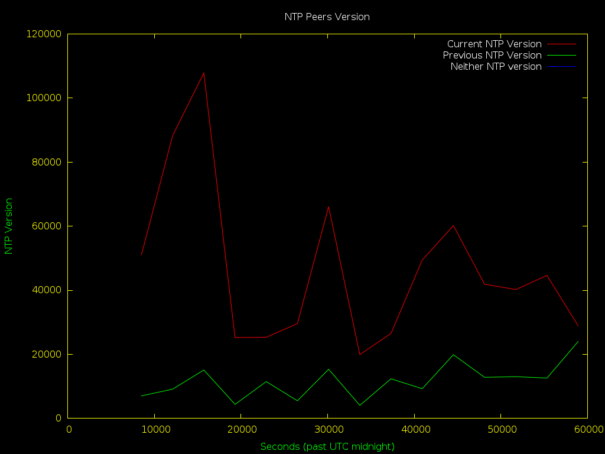
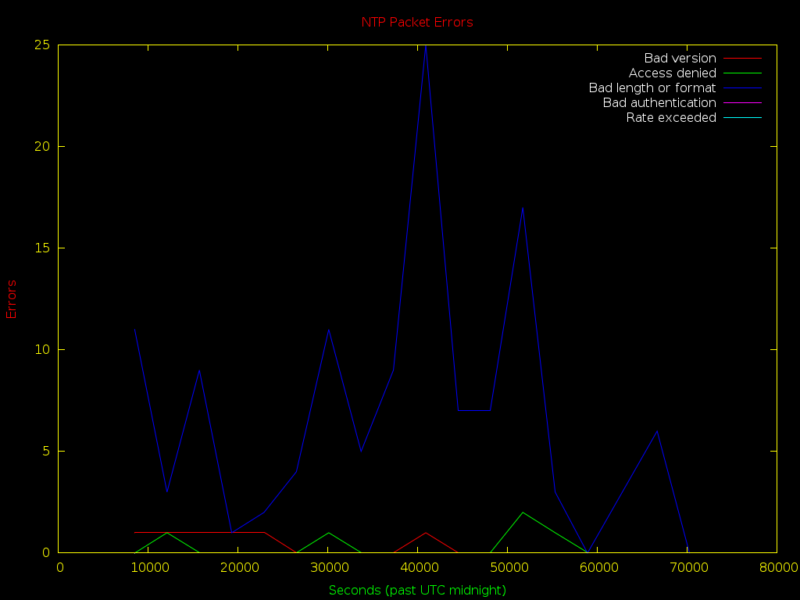

# ntpplot
## Plot NTP statistics and present them over HTTP!

### About
ntpplot leverages the robust statistics repoting built into NTP to plot various
graphs regarding normal and abnormal operation.

### Who is this for?
Anyone running a production NTP server (whether in an internal environment such
as a datacenter or an office, or an external pulic facing environment such as
contribution to pool.ntp.org) will benefit from a little transperency.

### How does this work?
The concept is simple and strives to leverage existing components:  
- A configuration file that sets up statistics output for NTP is included with
`includefile` in `ntp.conf`.
- A [Gnuplot](http://www.gnuplot.info/) script that generates the plots is configured with cron to run
preidically.
- An Apache configuration file allows serving the plots folder and images over HTTP.

### Requirements:
- [NTP version 4.2.8 or higher](http://www.ntp.org/) (untested with lower NTP 4.x versions, unlikely to work with 3.x and lower due to [log format changes](http://www.ntp.org/ntpfaq/NTP-s-trouble.htm#TAB-STATFIL))
- [Gnuplot version 4.6 or higher](http://www.gnuplot.info/) (untested with lower Gnuplot versions)
- [Apache version 2.4](https://httpd.apache.org/docs/2.4/) (optional - needed so serve plots over HTTP, will not work with Apache 2.2 as is)

### Installation:
```
git clone https://github.com/erikkugel/ntpplot.git /opt/ntpplot
mkdir -p -v /var/log/ntp
echo "includefile /opt/ntpplot/conf/ntp-stats.conf" >> /etc/ntp.conf
ln -v -s -f /opt/ntpplot/conf/cron-ntpplot /etc/cron.d/ntpplot
echo "Include /opt/ntpplot/conf/httpd-ntpplot.conf" >> /etc/httpd/httpd.conf
```
See the full Wiki [here](https://github.com/erikkugel/ntpplot/wiki/Installation).

### Screenshots:



### Resources:
[NTP Troubleshooting Guidelines](http://www.ntp.org/ntpfaq/NTP-s-trouble.htm)  
[NTP Advanced Logging Configuration](https://www.novell.com/support/kb/doc.php?id=7009361)
