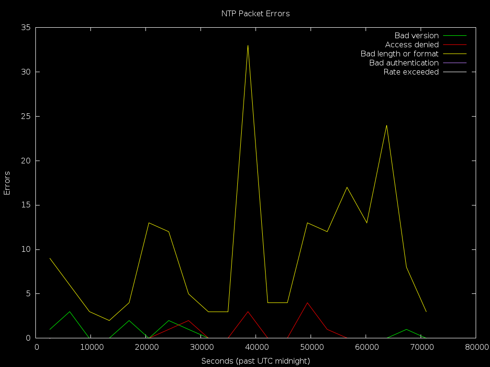

# ntpplot
## Plot NTP statistics and present them over HTTP!

### About
ntpplot levrages the robust statistics repoting built into NTP to plot various
graphhs regarding normal and abnormal operation.

### Who is this for?
Anyone running a production NTP server, whether in an internal environment such
as a datacenter or and office, or an external pulic facing environment such as
contribution to pool.ntp.org, will benefit from a little transperency.

### How does this work?
The concept is simple and strives to levrage existing components:  
- A configuration file that sets up statistics output for NTP is included with
`includefile` in `ntp.conf`.
- A Gnuplot script that generates the plots is configured with cron to run
preidically.
- An Apache2 configuration file allows service the plots folder over HTTP.

### Installation:
- Clone repo under `/opt`:
```
git clone https://github.com/erikkugel/ntpplot.git /opt/ntpplot
```
- Create a folder called `/var/log/ntp` owned by whichever user runs `ntp`:
```
mkdir -p -v /var/lot/ntp
```
- Include NTP's statistics configuration in `/etc/ntp.conf`:
```
echo "includefile /opt/ntpplot/conf/ntp-stats.conf" >> /etc/ntp.conf
```
- Symlink cron job configuration under `/etc/cron.d`:
```
ln -v -s -f /opt/ntpplot/conf/cron-ntpplot /etc/cron.d/ntpplot
```
- Include Apache config in Apache 2.4:
```
echo "Include /opt/ntpplot/conf/httpd-ntpplot.conf" >> /etc/httpd/httpd.conf
```

### Screenshots:


