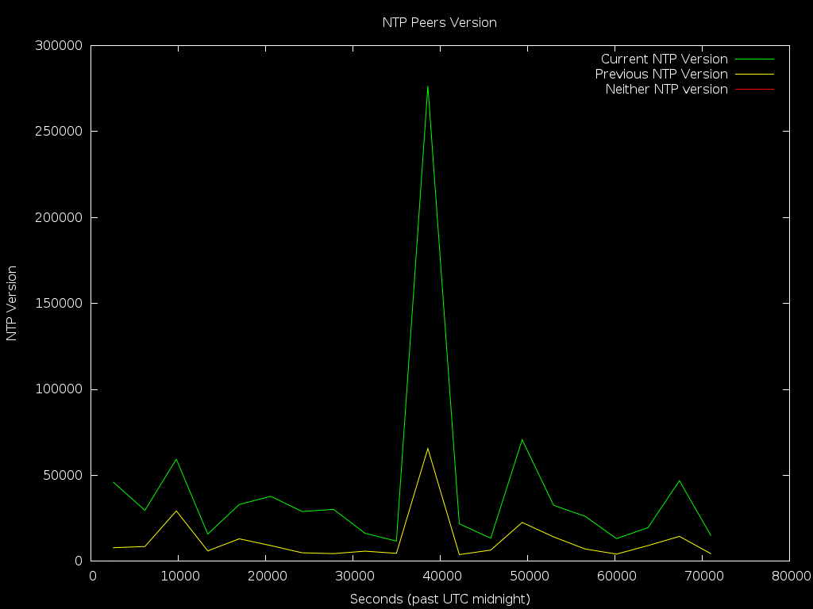

# ntpplot
## Plot NTP statistics and present them over HTTP!

### About
ntpplot levrages the robust statistics repoting built into NTP to plot various
graphhs regarding normal and abnormal operation.

### Who is this for?
Anyone running a production NTP server, whether in an internal environment such
as a datacenter or and office, or an external pulic facing environment such as
contribution to pool.ntp.org, will benefit from a little transperency.

### How does this work?
The concept is simple and strives to levrage existing components:  
- A configuration file that sets up statistics output for NTP is included with
`includefile` in `ntp.conf`.
- A Gnuplot script that generates the plots is configured with cron to run
preidically.
- An Apache2 configuration file allows service the plots folder over HTTP.

### Screenshots:

